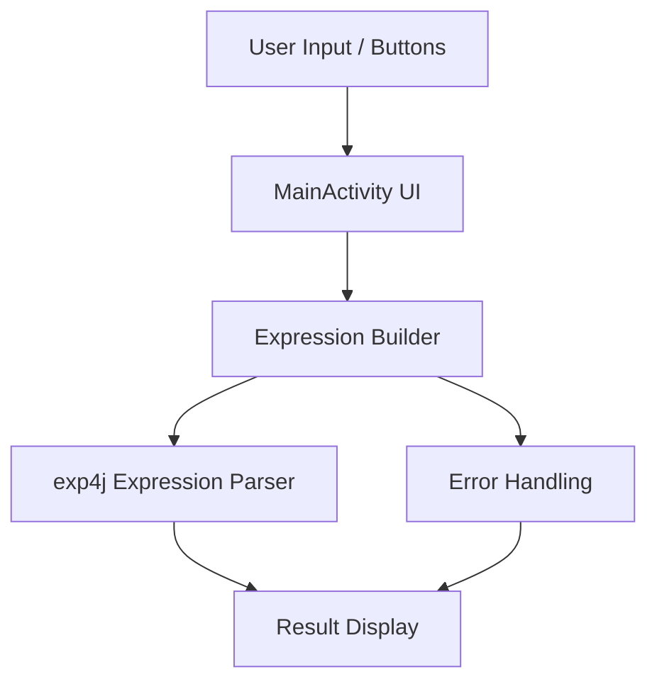

# Simple Calculator App

A simple Android calculator app built with Kotlin and Jetpack libraries.

## Overview

This project is a small Android application that evaluates arithmetic expressions using the `exp4j` library. It is configured with:

- Kotlin for Android
- Android SDK 34
- Minimum SDK 24
- Material Design components
- ConstraintLayout for responsive layouts

## Features

- Basic arithmetic expression evaluation
- Supports addition, subtraction, multiplication, division, parentheses, and decimal values
- Clean single-screen UI
- Built with Android Studio and Gradle

## Prerequisites

- Android Studio Flamingo or newer
- Java 11
- Android SDK installed for API level 34
- Gradle wrapper included in the project

## Build and Run

From the project root folder, use the Gradle wrapper:

Windows:

```powershell
./gradlew clean assembleDebug
./gradlew installDebug
```

macOS / Linux:

```bash
./gradlew clean assembleDebug
./gradlew installDebug
```

You can also open the project in Android Studio and run it on an emulator or connected device.

## Project Structure

- `app/` - Android application module
  - `src/main/` - app source code and resources
  - `build.gradle.kts` - module Gradle configuration
- `build.gradle.kts` - top-level Gradle settings
- `settings.gradle.kts` - project modules configuration
- `gradle/` - Gradle wrapper and version management
- `local.properties` - local SDK path (not checked into source control)

## Architecture Diagram



## Libraries

- `androidx.core:core-ktx`
- `androidx.appcompat:appcompat`
- `com.google.android.material:material`
- `androidx.activity:activity-ktx`
- `androidx.constraintlayout:constraintlayout`
- `net.objecthunter:exp4j:0.4.8`

## Notes

- Do not commit `local.properties`; it is environment-specific.
- The app uses the Gradle wrapper, so no global Gradle install is required.
- If you want to add features, update the `app/src/main` code and layout resources accordingly.

## Roadmap

- Add user-friendly button labels and improved visual feedback for operations
- Implement support for advanced functions such as exponentiation, square root, and percentage
- Add a history panel so users can review previous calculations
- Improve error handling for invalid expressions and divide-by-zero cases
- Add unit tests for calculator logic and UI tests for core workflows
- Polish styling and animations for better mobile usability
